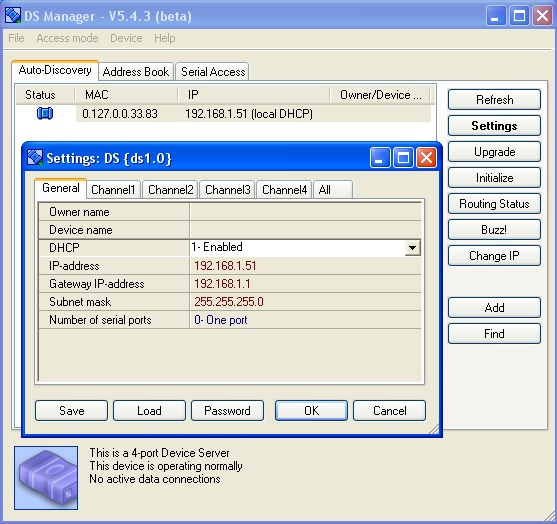
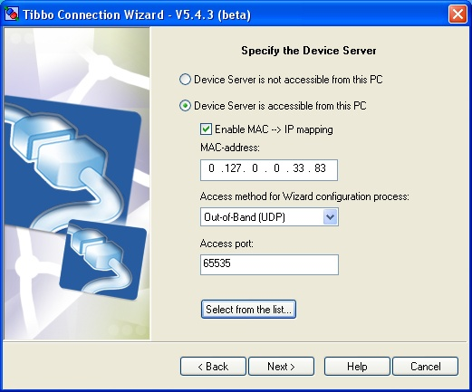
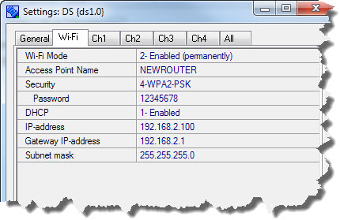

# Serial-over-IP (SoI) Application

**NEW! Our SoI app has been updated to support the WA2000 Wi-Fi/BLE add-on module.**

## About the Application

Many Tibbo customers first came to know us by our fixed-function device servers (such as the [DS203](http://tibbo.com/store/soi/controllers.html#ds203)) and modules ([EM203](http://tibbo.com/store/modules/em203.html)). This project is a serial-over-IP (SOI) application written in Tibbo BASIC. It runs on our BASIC-programmable devices, such as the new [DS110x](http://tibbo.com/store/controllers.html) family of programmable serial controllers. The application closely resembles our fixed SOI firmware.

Notable additions are:

- Support for the OLED display of [DS1101](http://tibbo.com/store/controllers/ds1101.html) and [DS1102](http://tibbo.com/store/controllers/ds1102.html) devices.
- Wi-Fi and GPRS support with seamless switching between Ethernet, WiFi, and GPRS.
- Web admin interface — setup your devices via the web browser;
- Multi-port and [multi-channel](http://tibbo.com/programmable/controllers.html#comp_table) operation;

Notable limitations:

- No support for start and end characters on the serial side.
- No LinkServer support.

Like our fixed firmware devices, the SOI application works with our [Tibbo Device Server Toolkit](http://tibbo.com/support/downloads/tide.html) (TDST). We have a separate [Serial-over-IP Solutions Manual](http://docs.tibbo.com/soism/) that explains everything in detail. Material on this page is meant as a simple introduction on how to use this SoI Tibbo BASIC application. We also briefly explain new stuff, like the **OLED display** or the **interface switchover**.

**As an example,** we will setup one serial port of the [DS1101](http://tibbo.com/store/controllers/ds1101.html) device to operate with a virtual serial port (VSP, a.k.a. "virtual COM") of the PC. There are many other device server usage scenarios which we will not talk about here.

## Preparing the DS1101

DS1101 devices ship with this SoI application preloaded and properly initialized. Just in case yours had it differently or was already used to run something else, here is what you do to prep the app:

- Download and install the [Tibbo Device Server Toolkit (TDST)](http://tibbo.com/support/downloads/tide.html) software for Windows. Install the latest version even if you already had TDST installed on your PC.
- Load the application using [Device Explorer](http://tibbo.com/support/downloads/tide.html). Subsequent upgrades of this application can be done via the DS Manager (part of the TDST).
- When you first run the application the device will enter the **error mode**, which means that it's setting (which are stored in the EEPROM) require initialization. The error mode is indicated by blinking red status LED. Devices with display will also have the following message on the screen:

*Note: SoI application automatically switches the display off after a certain timeout. To turn the display on, briefly press the MD button.*

When there is a display:

- If the display is off, briefly press the MD button to turn the display on.
- When in the "ERROR MODE" screen, press and hold the MD button until you see the "INIT COMPLETE" message.
- Reboot (power-cycle) the device.

When there is no display:

- Press the MD button once to enter the serial programming mode (red and green status LEDs blinking).
- Press and hold to initialize.
- Wait until the green status LED is turned on.
- Reboot (power-cycle) to complete the initialization.

After the reboot you should be able to see your device in the DS Manager. Initialized devices have their DHCP turned off, so your DS1101's IP will be 1.0.0.1.

***Note:** from time to time our users encounter firewall issues. You may have to disable your firewall (or allow UDP traffic on port 65535) for the DS Manager to be able to see your DS1101.*

## Setting the IP address

- Find your DS1101 in the DS Manager's list, click **Settings**.
- Enable DHCP or set the desired IP address.
- Click **OK**.
- The DS1101 will reboot with the new IP/DHCP configuration. You can click **Refresh** to see what IP address is actually being used by the DS1101 now.

## Using web admin

Once your devices has a same IP address and you know what it is you can also use your web browser to setup the DS1101. Point the browser to the target IP address and the rest is obvious.

*Hint: there is no password, just click **Login**. You can set the password later.*

## Configuring the VSP-DS1101 link

- Launch Connection Wizard (it is a part of the TDST).
- On the first screen, select "Create a link between a Virtual Serial Port and a Device Server". Click **Next**.
- Select the number of the VSP (virtual COM) you want to use. For example, select "Create new VSP" and choose **COM3** from the drop-down list (assuming that COM3 is unused on your PC). Click **Next**.
- Point at your device server. Click **Select** from the list and double-click on your DS1101 in the DS Manager's screen. Do not change anything else. Click **Next**.
- Select the channel (on the DS1101) the VSP on your PC will be communicating with. Click **Next** when done.
- Select which side (DS1101 or VSP) will send the data first. There are some configuration differences associated with this, but we won't go into such minute details here. "Any side" is a safe bet, so choose that and click **Next**.
- Next is the **Gateway and netmask settings** screen. Assuming that your DS1101 is plugged into the same network segment with your PC this screen will be skipped. Click **Next**.
- **Transport protocol and listening ports** screen. Everything you (normally) need is selected by default. You are going to use TCP/IP, and you don't really care about ports as long as everything works. Click **Next**.
- **On-the-fly commands** screen. These commands do a lot, but most importantly they configure the serial channel on your DS1101 as requested by the software that is using your virtual COM. For example, if an application wants 115200bps, then it will "tell" the (virtual) COM, and virtual COM will send an on-the-fly command to the DS1101 telling it to switch designated serial port to 115200bps. Got it? So, don't touch the default choice and click **Next**.
- **Serial settings for the device server** screen. No need to do anything here. We have on-the-fly commands enabled. Click **Next**.
- Now you are at the summary screen. You can review how the virtual COM and your DS1101 will be set. Click **Finish** and you are done!

## Testing the VSP-DS1101 link

Any "serial terminal" software will do and may we suggest our very own [I/O Ninja](http://tibbo.com/ninja.html).

- Download and install I/O Ninja.
- Select **File** > **New Session**.
- Choose **Serial** and click **OK**.
- Select your VSP and click **Open Port** (the lightning-bolt icon).
- I/O Ninja is now ready to send the data to the DS1101. ***Note:** our TDST software includes a Tibbo Monitor, which you can find in the system tray. This Tibbo Monitor maintains a log of virtual COM activity. Observe what happens when you open/close the port in I/O Ninja, change baudrate, etc.*

## Working with Wi-Fi and GPRS

This SOI application supports Wi-Fi and GPRS interfaces. The way it works, the app will try to choose the **best** interface among available and enabled interfaces.

The highest priority is always given to the Ethernet interface. It will be "active" for as long as there is a live cable plugged into the device. Unplug the cable, and your device will look for alternatives.

If there is a Wi-Fi interface, and it is enabled, your device will try to use it. Failing that, the device will turn to GPRS, again, if it is available and enabled. Plug the Ethernet cable back into the device, and the app will switch over to using it again.

The DS1101 can be optionally outfitted with the Wi-Fi interface ([GA1000](http://tibbo.com/store/wireless/ga1000.html) ad-on module). Assuming your device has it, let's go over the settings:

- Wi-Fi Mode:
  - *Permanent* means that Wi-Fi is always on. As soon as the device boots it will activate the GA1000 and attempt to associate with the network. This doesn't mean the link is *used*, only that it's on. As long as the device has a wired connection, that connection will be used. As soon as the Ethernet cable is unplugged, the device will hop over to Wi-Fi instantly, with no set-up time required since it's already associated. Note that each network interface will have a different IP address, so you won't be able to access the device's Ethernet IP when its cable has been disconnected. You would need to know (and use) the IP of the Wi-Fi interface.
  - *On demand* means the GA1000 is normally off. As soon as the device loses Ethernet connectivity, it fires up the GA1000 and attempts to associate wirelessly. Once the Ethernet link becomes available again, the device automatically shuts down the GA1000 and resumes wired operation. This mode is useful for conserving power.
- **Access Point Name:** That's the name of the access point you're trying to connect to. Be sure to get it right — it's case-sensitive.
- **Security:** You must select the security type your access point is using. If you're not sure what that is, try checking the access point configuration — it is always listed there. **Note:** When using WPA or WPA2, the first association with a new network for about 1.5 minutes. Both the green and red status LED will be on during this time, and the device will be busy crunching away some serious math. This is a one-time delay: once done, future associations will be very fast.
- **Password:** This is case-sensitive, of course. **Note:** ASCII passwords for WEP are *not* supported. If you're using WEP, you must enter a hexadecimal password (ten characters long).
- **DHCP and other network settings:** Nothing Wi-Fi specific here. These are the same settings you already know from wired connections. We advise enabling DHCP unless you have a specific reason not to do so. **Note:** Do *not* attempt to set the same IP address for both the wired and wireless adaptors. It's not going to work. The Wi-Fi interface is a separate interface, so it must have its own IP.

## Need more information?

Read our [Serial-over-IP Solutions Manual](http://docs.tibbo.com/soism/)!