# Serial-over-IP (SoI) Application

## About the SoI Application

Many Tibbo customers first came to know us by our fixed-function Serial-over-IP (SoI) devices, a.k.a. Serial-to-IP converters, a.k.a. serial device servers.
Examples of such converters are the [DS203](https://tibbo.com/store/controllers/ds203.html) device server and the [EM203](https://tibbo.com/store/modules/em203.html) module.
These products are supplied with traditional "fixed" firmware.

This project is a Serial-over-IP (SoI) application written in Tibbo BASIC. It runs on our BASIC/C-programmable devices,
such as the [DS/WS110x](https://tibbo.com/store/controllers.html) family of programmable serial controllers.
The features offered by the SoI application closely resemble, and in many cases, exceed those of our fixed SoI firmware.

Notably, the SoI application additionally supports:
* Up to four serial ports (channels)
* Wi-Fi and 4G communications
* Device configuration via BLE and the L.U.I.S. app ([iOS](https://apps.apple.com/app/luis/id1450127637), [Android](https://play.google.com/store/apps/details?id=com.tibbo.tibboble), and [web](https://apps.tibbo.com/luis))
* Configuration via a browser
* Status indication on a display

The following table details the feature availability for various Tibbo devices (not all supported devices are shown):

<table style="text-align: center">
  <thead>
    <tr>
      <td width="23%">Feature</td>
      <td width="11%">WS1102</td>
      <td width="10%">DS1100</td>
      <td width="10%">DS1101</td>
      <td width="10%">DS1102</td>
      <td width="14%">TPP/TPS3 (G2)</td>
      <td width="11%">EM2000/ EM2001</td>
    </tr>
  <tbody>
    <tr>
      <td>No. of serial ports (channels)</td>
      <td colspan="2">1 port</td>
      <td>3.5 channels</td>
      <td>3 channels</td>
      <td colspan="2">4 ports</td>
    </tr>
    <tr>
      <td>Wi-Fi</td>
      <td>Yes</td>
      <td>No</td>
      <td colspan="4">Yes*</td>
    </tr>
    <tr>
      <td>4G (LTE) / Cat-M1 / NB-IoT</td>
      <td colspan="4">No</td>
      <td colspan="2">Yes*</td>
    </tr>
    <tr> 
      <td>Configuration via BLE</td>
      <td>Yes</td>
      <td colspan="5">No</td>
    </tr>
    <tr>
      <td>Configuration via Browser</td>
      <td colspan="6">Yes</td>
    </tr>
    <tr>
      <td>Status Display</td>
      <td colspan="2">No</td>
      <td colspan="2">Yes*</td>
      <td colspan="2">No</td>
    </tr>
</table>

_* Requires optional hardware_  

Like all Tibbo device servers, the SoI application works with the [Tibbo Device Server Toolkit (TDST)](https://tibbo.com/support/downloads/tide.html).
We have a separate [Serial-over-IP Solutions Manual](http://docs.tibbo.com/soism/) that explains everything in detail. 
Material on this page is meant as a simple introduction on how to use this SoI Tibbo BASIC application. 

The explanation focuses on two supported devices:
the [DS1101](https://tibbo.com/store/controllers/ds1101.html) and the new **fully wireless** [WS1102](https://tibbo.com/store/controllers/ws1102.html) serial controller.
Other devices are not covered, but their configuration is very similar to what is described here.

---

## Preparing your device

### Connecting the DS1101 to your Ethernet network

The DS1101 has an Ethernet interface. It is connected as soon as you plug a live Ethernet cable into the DS1101.
Once the DS1101 is connected to an Ethernet switch (router), its yellow Link LED turns on.

### Uploading the SoI app

All [DS/WS110x family devices](https://tibbo.com/store/controllers.html) ship with the SoI application preloaded and properly initialized.
If you need to reload and reinitialize the application — for example, in case your device was used to run something else — follow the steps below.

* Download and install the latest version of the [Tibbo Device Server Toolkit (TDST)](https://tibbo.com/support/downloads/tdst.html) software for Windows.
* Upload the SoI app binary (.BIN) into your DS1101 using the [Device Explorer](https://tibbo.com/support/downloads/tide.html).

Subsequent firmware upgrades can also be performed via [DS Manager](https://tibbo.com/soi/software.html#ds-manager) (part of the TDST).

### Initializing SoI Settings
When you first run the application, the device might enter the **error mode**, which means that its settings (programmable parameters stored in the EEPROM) require initialization.
The error mode is indicated by a blinking red status LED. Devices with a display will also have the following message on the screen: "ERROR MODE! Press & hold to reinitialize the device."
To fix this, initialize the SoI settings:
* If your device has a display
  * Briefly press the MD button to turn the display on
  * When at the "ERROR MODE" screen, press and hold the MD button until you see the "INIT COMPLETE" message
  * Reboot (power-cycle) the device to complete the initialization
* If your device has no display
  * Press the MD button once to enter the serial programming mode (red and green status LEDs blinking)
  * Press and hold the MD button
  * Wait until the green status LED turns on (initialization finished)
  * Reboot (power-cycle) the device to complete the initialization

After the reboot, you should be able to see your device in DS Manager. Initialized devices have their DHCP turned off, so your DS1101's IP will be 1.0.0.1.

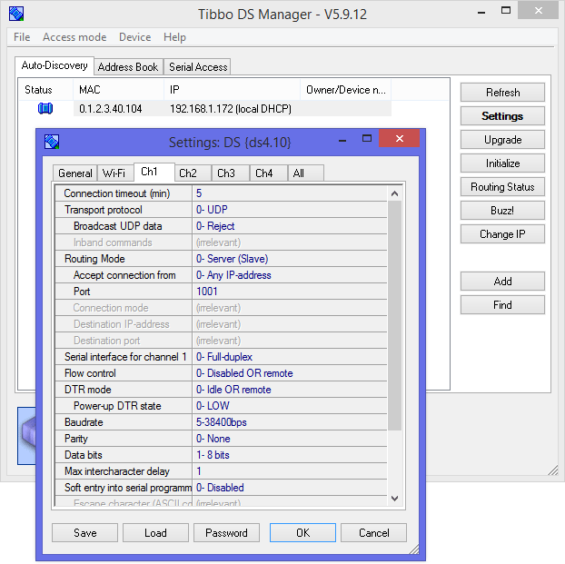

 

_**Note:** From time to time, our users encounter firewall issues. You may have to disable your firewall (or allow UDP traffic on port 65535) for DS Manager to be able to see your device._

---

### Connecting the WS1102 to your Wi-Fi network

The WS1102 is a wireless device, so it has to be configured for connecting to your Wi-Fi network (access point).
The Wi-Fi settings are stored in a Device Configuration Block (DCB) located in the flash memory.
You must have the device connected to your Wi-Fi network before proceeding with anything else.

The procedure below explains the configuration process through the BLE interface.
The assumption is that you have the SoI Companion App present on the WS1102 as APP0 (every WS1102 ships with this app preloaded).

The steps:
* Install the L.U.I.S. app ([iOS](https://apps.apple.com/app/luis/id1450127637), [Android](https://play.google.com/store/apps/details?id=com.tibbo.tibboble)) on your smartphone.
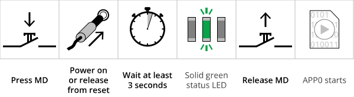

* Power off your WS1102. Press and hold the MD button, then power the device back on.
* Wait at least 3 seconds for the red status LED to turn off. When the green status LED turns on, release the MD button.
* Open the L.U.I.S. app and select your WS1102. You will be presented with a configuration screen (shown on the right).
* In the configuration screen, set the following parameters:
    * **Access Point Name** should be set to the SSID of your Wi-Fi network (access point). This field is case-sensitive.
    * **Password** should match the password of your Wi-Fi network (access point). This field is case-sensitive.
    * **DHCP** would normally be enabled. Alternatively, set the desired...
    * ...**IP-address** (and if your device will be accessing outside of your LAN, you will also need to configure the **Gateway IP-address** and **Subnet mask**).

Once the WS1102 associates with your Wi-Fi network, its yellow Link LED turns on.

### Uploading the SoI app

All [DS/WS110x family devices](https://tibbo.com/store/controllers.html) ship with the SoI application preloaded and properly initialized.
If you need to reload and reinitialize the application — for example, in case your device was used to run something else — follow the steps below.

The explanation below shows how to upload the SoI app via the Wi-Fi interface.
It is also possible to upload the SoI app into the WS1102 via the BLE interface using .TCU files.
For step-by-step instructions on BLE uploads, see our [documentation](https://docs.tibbo.com/phm/ml_ble).

The steps:
* Download and install the latest version of the [Tibbo Device Server Toolkit (TDST)](https://tibbo.com/support/downloads/tdst.html) software for Windows.
* Upload the SoI app binary (.BIN) into your WS1102 using [Device Explorer](https://tibbo.com/support/downloads/tide.html).

Subsequent firmware upgrades can also be performed via [DS Manager](https://tibbo.com/soi/software.html#ds-manager) (part of the TDST).

### Initializing SoI Settings
When you first run the application, the device might enter the **error mode**, which means that its settings (programmable parameters stored in the EEPROM) require initialization.
The error mode is indicated by a blinking red status LED. To fix this, initialize the SoI settings:

* Press the MD button once to enter the serial programming mode (red and green status LEDs blinking)
* Press and hold the MD button
* Wait until the green status LED turns on (initialization finished)
* Reboot (power-cycle) the device to complete the initialization

After the reboot, you should be able to see your device in DS Manager. If your WS1102 is running with DHCP turned off, it will use the fixed IP address you set earlier.

 

_**Note:** From time to time, our users encounter firewall issues. You may have to disable your firewall (or allow UDP traffic on port 65535) for DS Manager
to be able to see your device._

---

## Configuring the VSP-device link

To configure a Virtual Serial Port (VSP) for use with your device, launch the [Connection Wizard](https://tibbo.com/soi/software.html#connection-wizard) (it is a part of the TDST) and follow these steps:

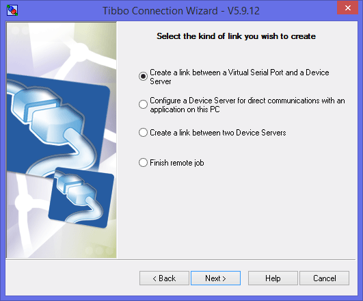

On the first screen, select **Create a link between a Virtual Serial Port and a Device Server**.

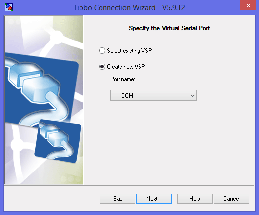

Decide on the virtual serial port (number) you want to use.

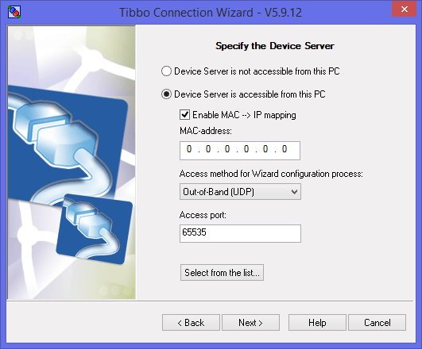

Click __Device Server is accessible from this PC__ and check (enable) __Enable MAC --> IP mapping__. After that, click on __Select from the list__ button.
__DS Manager__ will appear.

_Note: This assumes the simplest scenario — your PC and the SoI device are located on the same local network segment. **Connection Wizard** can handle much more complex arrangements, but explaining those falls outside the scope of this simple walkthrough._

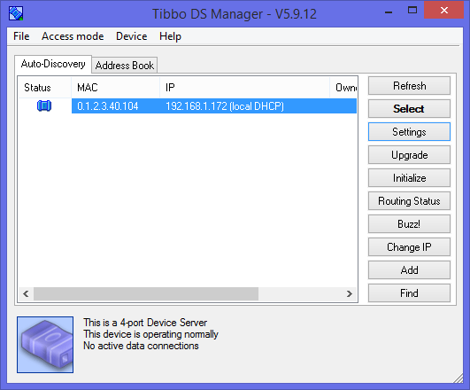

In __DS Manager__, double-click on your device in the list. When you return to the __Connection Wizard__, do not change anything else; just click **Next**.

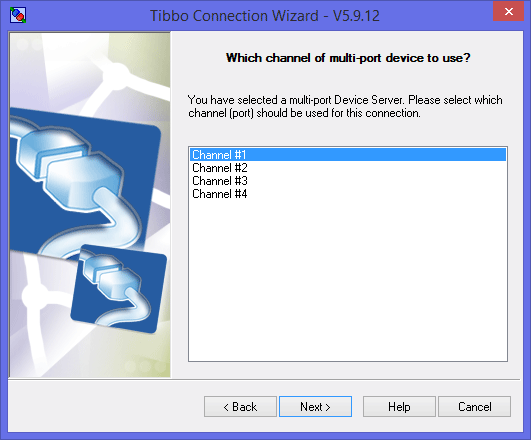

You will only see this screen if your device has more than one serial port or channel.
Therefore, the screen will be shown for the DS1101 (it has 3.5 channels) and won't appear for a single-port WS1102. Select the serial port or channel of the SoI device. This will be the port (channel) with which your VPS will be communicating.

Select which side — the SoI device or the VSP — will be sending the data first. There are some configuration differences associated with this, but we won't go into such minute details here. Selecting __Any side__ is a safe bet in most cases.

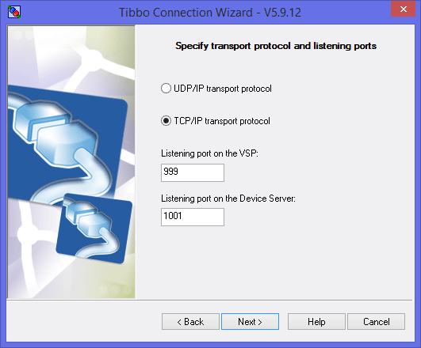

You don't have to alter any defaults appearing on this screen.

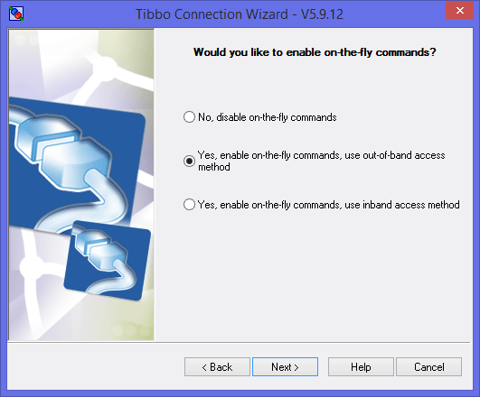

On-the-fly commands do a lot, but most importantly, they configure the serial port (channel) of your SoI device as requested by the software using your virtual COM. Keep the default __Yes, enable on-the-fly commands__ selection!

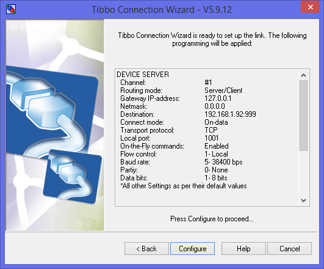

Click __Configure__ to finish the configuration.

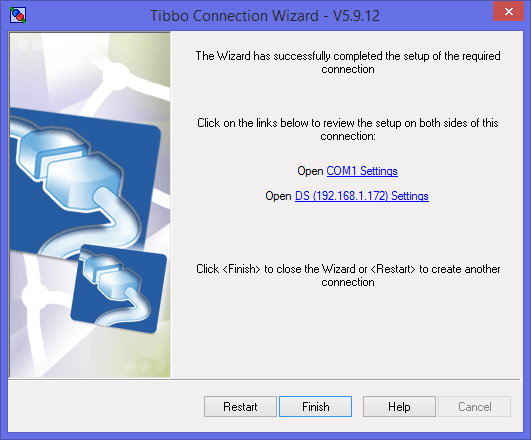

That's it! You are done. Your SoI device is now configured as a remote COM port of your PC!

---

## Testing the VSP-device link

Any "serial terminal" software will do — we suggest our very own [IO Ninja](https://ioninja.com).

* Download and install **IO Ninja**
* Select **File** > **New Session**
* Choose **Serial** and click **OK**
* Select your VSP and click **Open Port** (the lightning bolt icon).
* **IO Ninja** is now ready to send data to the device

_**Note:** Our TDST software includes the __Tibbo Monitor__; it is found in the system tray. __Tibbo Monitor__ maintains a log of all VSP activity. Observe what happens when you open and close your VSP port in __IO Ninja__, change the baudrate, etc._
